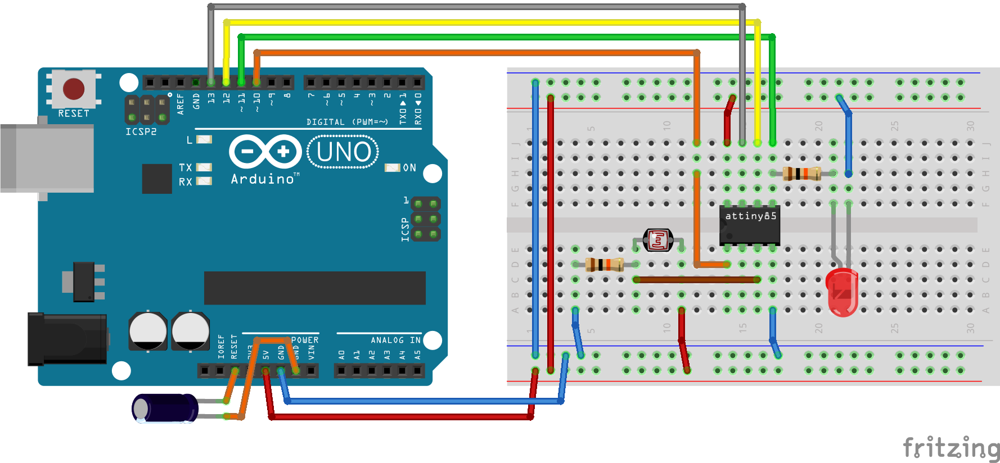
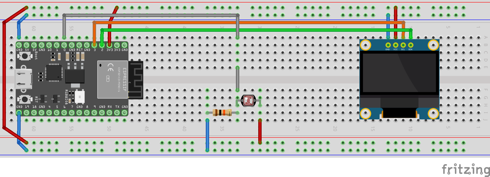

# Introduction to embedded Rust

This is the source code for my talk "Introduction to embedded Rust". It has been given a few times:

* 2023-06 at [Sunny Tech](https://sunny-tech.io/) in Montpellier, FR - [slides](https://docs.google.com/presentation/d/e/2PACX-1vQr1QGi3g3IgscX5RxKF-moIQLCDJACscTE-RAjRyfBJSvqkMLNrlSs8vs3i2NaI4PL5PI0ag3fb5Fq/pub)
* 2023-04 at [Devoxx](https://www.devoxx.fr/) in Paris, FR - [slides](https://docs.google.com/presentation/d/e/2PACX-1vQJjc4setj6SflkhBC4Q6iN-av290WNFgKVmdT1MzguRBUEUiyqBXQTWT2pOMZuCLHh1RveDIOBAZ4B/pub), [video](https://www.youtube.com/watch?v=w-HGwLAtJr8) (fr).
* 2022-11 at the Elastic Rust Guild - [slides](https://docs.google.com/presentation/d/e/2PACX-1vQQf8JCeoIuUm98XDuzg1yzfgfku3OcY-W9JL_1Rhw-FaMXPpdGU93jeDcCD2Q7RMvajOdt1hipcXp7/pub), [video](https://www.youtube.com/watch?v=pDoOPl5ptGs) (en).
* 2022-11 at [Capitole du Libre](https://capitoledulibre.org/) in Toulouse, FR - [slides](https://docs.google.com/presentation/d/e/2PACX-1vQQf8JCeoIuUm98XDuzg1yzfgfku3OcY-W9JL_1Rhw-FaMXPpdGU93jeDcCD2Q7RMvajOdt1hipcXp7/pub), [video](https://www.youtube.com/watch?v=2SxO74QofRA) (fr), [git branch](https://github.com/swallez/intro-embdedded-rust/tree/2211-capitole-du-libre).

There are two projects:

* [`intro-attiny`](intro-attiny): a "blink" demo for an attiny85, with a variable rate driven by a LDR (light dependent resistor)
* [`intro-esp32`](intro-esp32): two demos for an ESP32
  * Display the value of an LDR on a tiny OLED display.
  * Display the value of an LDR on a self-refreshing web page with an embedded http server powered by ESP-IDF.

Along with the code, each directory also contains the schematics of the circuits that were use so that you can replicate it:

Useful links:

* [Rust Embedded main page](https://github.com/rust-embedded).
* [Rust on AVR devices](https://github.com/avr-rust/).
* [Rust on ESP devices](https://github.com/esp-rs).

