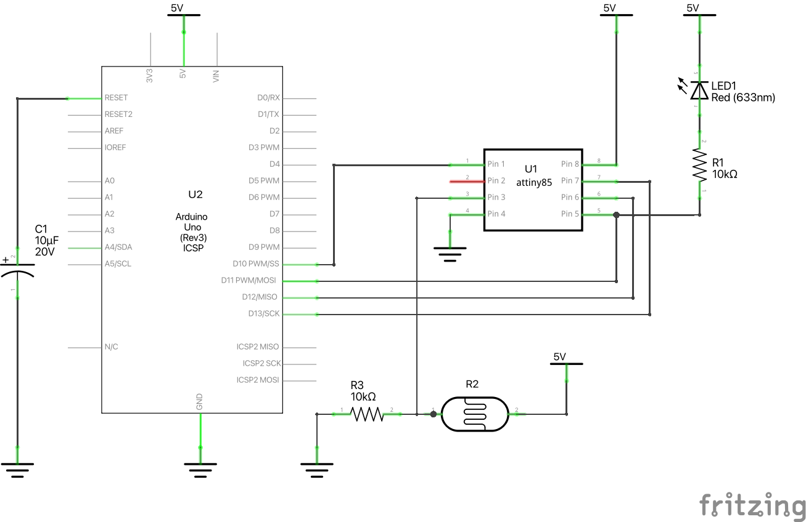

# Rust on attiny85

The attiny85 is a very small 8 bits AVR microcontroller. Small by its size, it only has 8 pins, and small by it's capacity, since it only has 512 bytes of RAM (yes, half a kilobyte) and 8 kB of Flash memory. And yet you can do a lot of things with this, when working on the bare metal!

### Flashing the attiny85

The attiny85 must be flashed with the [ISP protocol](https://en.wikipedia.org/wiki/In-system_programming). While there exists some [dedicated USB-to-ISP adapters](https://www.sparkfun.com/products/11801), an Arduino Uno [can be used for that](https://docs.arduino.cc/built-in-examples/arduino-isp/ArduinoISP), and this is what is illustrated below. The Arduino must be flashed with the "ArduinoISP" sketch found in the Arduino IDE's examples. The AVR Rust toolchain can then flash the attiny85 through the Arduino's USB-serial interface.

The electronics for this demo consist in:
* an attiny85 microcontroller,
* a LED with a 10 kΩ current limiter resistor connected on pin 5,
* a photoresistor (aka LDR) connected to pin 3 through a voltage divider using a 10 kΩ resistor.

Notice also the 10 μF capacitor on the Arduino's reset pin, [that may be needed depending](https://docs.arduino.cc/built-in-examples/arduino-isp/ArduinoISP) on the Arduino board you're using.

