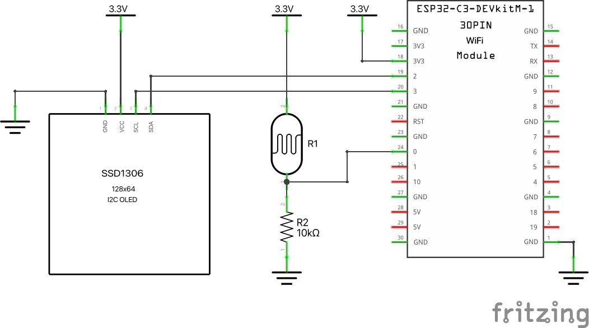

# Rust on ESP32

The ESP32 family is a family of powerful modern microcontrollers. The code in this repository uses the ESP-IDF framework, which provides a rust-std environment, with memory allocation, threads, network sockets, etc.

The electronics for this demo consist in:
* an [ESP32-C3-DevKitM-1](https://docs.espressif.com/projects/esp-idf/en/latest/esp32c3/hw-reference/esp32c3/user-guide-devkitm-1.html) development board, containing a RISC-V microcontroller,
* a photoresistor (aka LDR) connected to pin 3 through a voltage divider using a 10 kΩ resistor,
* a SSD1306 128x64 pixels monochrome display, connected via an [I2C bus](https://en.wikipedia.org/wiki/I%C2%B2C).

These components are powered with the 3.3 V output from the ESP32 board.

